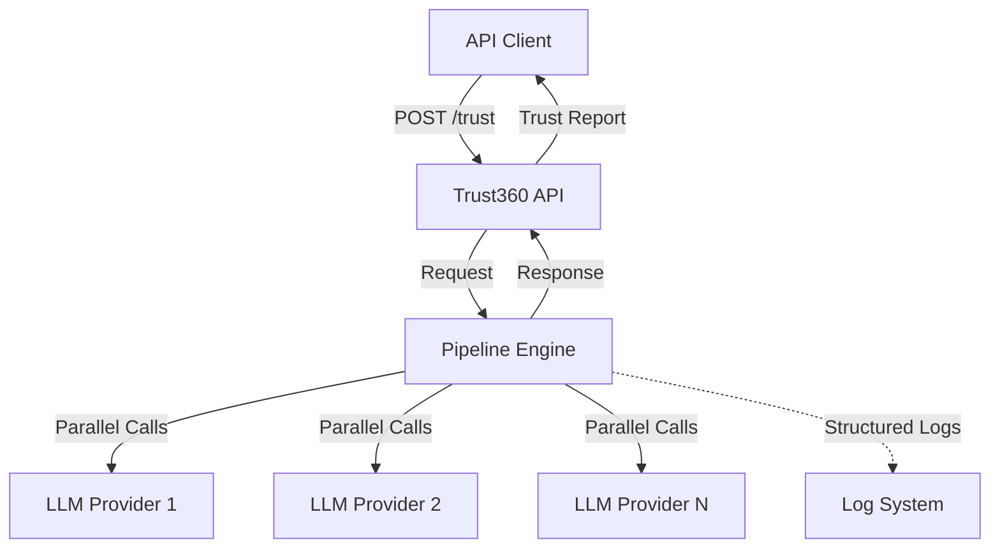
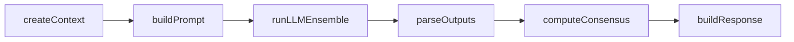

# Design Document: Trust360 v0.1 Pipeline

## Overview

Trust360 v0.1 is a modular AI trust evaluation engine built on a deterministic, stage-based pipeline architecture. The system accepts trust evaluation requests via HTTP, processes them through six sequential stages, executes multiple LLMs in parallel, and returns structured consensus reports with trust scores and agreement metrics.

The core architectural principle is a pure functional pipeline where each stage transforms a shared Context_Object. This design enables:
- Deterministic execution flow
- Clear separation of concerns
- Extensibility for future stages
- Comprehensive observability through structured logging
- Parallel LLM execution for performance

The system operates as a stateless service with no persistence layer, focusing exclusively on request processing and consensus computation.

## Architecture

### System Context



### Pipeline Architecture

The pipeline executes six stages in strict sequential order:



Each stage follows the signature: `async stage(ctx: Context_Object) => Context_Object`

**Stage Responsibilities:**

1. **createContext**: Initialize Context_Object with request data, generate Trace_ID, set timestamps
2. **buildPrompt**: Generate structured prompt from templates, inject question and evidence
3. **runLLMEnsemble**: Execute parallel LLM calls via LLM_Wrapper, collect raw responses
4. **parseOutputs**: Parse and validate model responses, filter invalid outputs
5. **computeConsensus**: Calculate MOS, variance, and agreement classification
6. **buildResponse**: Format final response payload with consensus report and metrics

**Pipeline Execution Flow:**

```javascript
async function executePipeline(request) {
  let ctx = {};
  
  for (const stage of stages) {
    ctx = await stage(ctx);
  }
  
  return ctx.response;
}
```

The pipeline maintains controlled mutation: each stage receives the context, modifies it, and returns it. Stages do not compose or call each other directly.

### Error Handling Strategy

**Critical Stages** (failure causes 500 response):
- createContext
- buildPrompt
- runLLMEnsemble (if all models fail)
- computeConsensus
- buildResponse

**Non-Critical Failures** (partial success with 206 response):
- Individual model failures in runLLMEnsemble (if at least 1 succeeds)
- Individual validation failures in parseOutputs

**Timeout Handling:**
- Each model call has a 20s timeout
- Timeouts are treated as model failures
- Logged with Trace_ID for debugging

## Components and Interfaces

### HTTP API Layer

**Endpoint:** `POST /trust`

**Request Schema:**
```typescript
interface TrustRequest {
  question: string;        // Required, max 2000 chars
  evidence?: string;       // Optional, max 5000 chars
  metadata?: Record<string, any>; // Optional, passed through
}
```

**Response Schema (200/206):**
```typescript
interface TrustResponse {
  traceId: string;
  consensus: {
    mos: number;           // Mean Opinion Score (1-10)
    variance: number;      // Statistical variance
    agreement: 'high' | 'medium' | 'low';
  };
  models: Array<{
    model: string;
    score: number;         // 1-10
    confidence: number;    // 0-1
    reasoning: string;
    assumptions: string[];
  }>;
  metrics: {
    totalModels: number;
    successfulModels: number;
    failedModels: number;
    executionTimeMs: number;
  };
}
```

**Error Response Schema (400/500):**
```typescript
interface ErrorResponse {
  traceId?: string;
  error: string;
  details?: string;
  statusCode: number;
}
```

**Validation Rules:**
- question: required, string, 1-2000 characters
- evidence: optional, string, 0-5000 characters
- metadata: optional, object

**Fastify Route Handler:**
```javascript
fastify.post('/trust', {
  schema: {
    body: {
      type: 'object',
      required: ['question'],
      properties: {
        question: { type: 'string', minLength: 1, maxLength: 2000 },
        evidence: { type: 'string', maxLength: 5000 },
        metadata: { type: 'object' }
      }
    }
  }
}, async (request, reply) => {
  try {
    const result = await executePipeline(request.body);
    const statusCode = result.metrics.failedModels > 0 ? 206 : 200;
    return reply.code(statusCode).send(result);
  } catch (error) {
    // Error handling logic
  }
});
```

### Pipeline Engine

**Stage Registry:**
```javascript
const stages = [
  createContext,
  buildPrompt,
  runLLMEnsemble,
  parseOutputs,
  computeConsensus,
  buildResponse
];
```

**Pipeline Executor:**
```javascript
async function executePipeline(requestBody) {
  let ctx = { request: requestBody };
  
  try {
    for (const stage of stages) {
      ctx = await stage(ctx);
    }
    return ctx.response;
  } catch (error) {
    logger.error({ traceId: ctx.traceId, error: error.message, stage: error.stage });
    throw error;
  }
}
```

### Stage Implementations

#### Stage 1: createContext

**Purpose:** Initialize the Context_Object with request data and metadata

**Input:** `{ request: TrustRequest }`

**Output:** Context_Object with initialized fields

**Implementation:**
```javascript
async function createContext(ctx) {
  const traceId = uuidv4();
  const startTime = Date.now();
  
  return {
    ...ctx,
    traceId,
    startTime,
    question: ctx.request.question,
    evidence: ctx.request.evidence || null,
    metadata: ctx.request.metadata || {},
    rawResponses: [],
    validResponses: [],
    consensus: null,
    response: null
  };
}
```

**Logging:**
```javascript
logger.info({ traceId, stage: 'createContext', action: 'initialized' });
```

#### Stage 2: buildPrompt

**Purpose:** Generate structured prompt for LLM evaluation

**Input:** Context_Object with question and evidence

**Output:** Context_Object with prompt field added

**Prompt Template:**
```
You are evaluating the trustworthiness of a claim. Analyze the question and any provided evidence, then respond with a structured assessment.

QUESTION:
{question}

{evidence_section}

Provide your response in the following JSON format:
{
  "score": <number 1-10>,
  "reasoning": "<your detailed reasoning>",
  "confidence": <number 0-1>,
  "assumptions": ["<assumption 1>", "<assumption 2>", ...]
}

SCORING GUIDE:
1-3: Low trust (significant concerns, contradictions, or lack of evidence)
4-6: Medium trust (some concerns or incomplete evidence)
7-9: High trust (strong evidence and logical consistency)
10: Very high trust (overwhelming evidence and no concerns)

CONFIDENCE: Your certainty in this assessment (0 = not confident, 1 = very confident)

ASSUMPTIONS: List any assumptions you made during evaluation
```

**Implementation:**
```javascript
async function buildPrompt(ctx) {
  const evidenceSection = ctx.evidence 
    ? `EVIDENCE:\n${ctx.evidence}\n` 
    : '';
  
  const prompt = PROMPT_TEMPLATE
    .replace('{question}', ctx.question)
    .replace('{evidence_section}', evidenceSection);
  
  logger.info({ 
    traceId: ctx.traceId, 
    stage: 'buildPrompt', 
    action: 'completed',
    promptLength: prompt.length 
  });
  
  return { ...ctx, prompt };
}
```

#### Stage 3: runLLMEnsemble

**Purpose:** Execute parallel LLM calls and collect raw responses

**Input:** Context_Object with prompt

**Output:** Context_Object with rawResponses array

**Model Configuration:**
```javascript
const MODEL_CONFIG = [
  { provider: 'openai', model: 'gpt-4', timeout: 20000 },
  { provider: 'anthropic', model: 'claude-3-opus', timeout: 20000 },
  { provider: 'openai', model: 'gpt-3.5-turbo', timeout: 20000 }
];
```

**Implementation:**
```javascript
async function runLLMEnsemble(ctx) {
  const modelPromises = MODEL_CONFIG.map(config => 
    callLLM(config, ctx.prompt, ctx.traceId)
  );
  
  const results = await Promise.allSettled(modelPromises);
  
  const rawResponses = results.map((result, index) => ({
    model: MODEL_CONFIG[index].model,
    status: result.status,
    response: result.status === 'fulfilled' ? result.value : null,
    error: result.status === 'rejected' ? result.reason.message : null
  }));
  
  const successCount = rawResponses.filter(r => r.status === 'fulfilled').length;
  
  if (successCount === 0) {
    logger.error({ 
      traceId: ctx.traceId, 
      stage: 'runLLMEnsemble', 
      error: 'All models failed' 
    });
    throw new Error('All LLM calls failed');
  }
  
  logger.info({ 
    traceId: ctx.traceId, 
    stage: 'runLLMEnsemble', 
    successCount, 
    failedCount: rawResponses.length - successCount 
  });
  
  return { ...ctx, rawResponses };
}
```

#### Stage 4: parseOutputs

**Purpose:** Parse and validate model responses

**Input:** Context_Object with rawResponses

**Output:** Context_Object with validResponses array

**Validation Rules:**
- score: number, 1-10 inclusive
- reasoning: string, non-empty
- confidence: number, 0-1 inclusive
- assumptions: array of strings

**Implementation:**
```javascript
async function parseOutputs(ctx) {
  const validResponses = [];
  
  for (const raw of ctx.rawResponses) {
    if (raw.status !== 'fulfilled') continue;
    
    try {
      const parsed = JSON.parse(raw.response);
      
      // Validate schema
      if (!isValidModelResponse(parsed)) {
        logger.warn({ 
          traceId: ctx.traceId, 
          stage: 'parseOutputs', 
          model: raw.model,
          error: 'Validation failed' 
        });
        continue;
      }
      
      validResponses.push({
        model: raw.model,
        score: parsed.score,
        reasoning: parsed.reasoning,
        confidence: parsed.confidence,
        assumptions: parsed.assumptions
      });
      
    } catch (error) {
      logger.warn({ 
        traceId: ctx.traceId, 
        stage: 'parseOutputs', 
        model: raw.model,
        error: 'Parse failed' 
      });
    }
  }
  
  logger.info({ 
    traceId: ctx.traceId, 
    stage: 'parseOutputs', 
    validCount: validResponses.length 
  });
  
  return { ...ctx, validResponses };
}

function isValidModelResponse(obj) {
  return (
    typeof obj.score === 'number' &&
    obj.score >= 1 &&
    obj.score <= 10 &&
    typeof obj.reasoning === 'string' &&
    obj.reasoning.length > 0 &&
    typeof obj.confidence === 'number' &&
    obj.confidence >= 0 &&
    obj.confidence <= 1 &&
    Array.isArray(obj.assumptions)
  );
}
```

#### Stage 5: computeConsensus

**Purpose:** Calculate consensus metrics from valid responses

**Input:** Context_Object with validResponses

**Output:** Context_Object with consensus object

**Consensus Algorithms:**

**Mean Opinion Score (MOS):**
```javascript
function calculateMOS(scores) {
  const sum = scores.reduce((acc, score) => acc + score, 0);
  return sum / scores.length;
}
```

**Variance:**
```javascript
function calculateVariance(scores, mean) {
  const squaredDiffs = scores.map(score => Math.pow(score - mean, 2));
  return squaredDiffs.reduce((acc, val) => acc + val, 0) / scores.length;
}
```

**Agreement Classification:**
```javascript
function classifyAgreement(variance) {
  if (variance < 0.5) return 'high';
  if (variance < 1.5) return 'medium';
  return 'low';
}
```

**Implementation:**
```javascript
async function computeConsensus(ctx) {
  const scores = ctx.validResponses.map(r => r.score);
  
  const mos = calculateMOS(scores);
  const variance = calculateVariance(scores, mos);
  const agreement = classifyAgreement(variance);
  
  const consensus = {
    mos: Math.round(mos * 100) / 100, // Round to 2 decimals
    variance: Math.round(variance * 100) / 100,
    agreement
  };
  
  logger.info({ 
    traceId: ctx.traceId, 
    stage: 'computeConsensus', 
    consensus 
  });
  
  return { ...ctx, consensus };
}
```

#### Stage 6: buildResponse

**Purpose:** Format final response payload

**Input:** Context_Object with all computed data

**Output:** Context_Object with response object

**Implementation:**
```javascript
async function buildResponse(ctx) {
  const executionTimeMs = Date.now() - ctx.startTime;
  const totalModels = ctx.rawResponses.length;
  const successfulModels = ctx.validResponses.length;
  const failedModels = totalModels - successfulModels;
  
  const response = {
    traceId: ctx.traceId,
    consensus: ctx.consensus,
    models: ctx.validResponses,
    metrics: {
      totalModels,
      successfulModels,
      failedModels,
      executionTimeMs
    }
  };
  
  logger.info({ 
    traceId: ctx.traceId, 
    stage: 'buildResponse', 
    action: 'completed',
    executionTimeMs 
  });
  
  return { ...ctx, response };
}
```

### LLM Wrapper

**Purpose:** Single abstraction layer for all LLM calls with observability

**Interface:**
```typescript
interface LLMConfig {
  provider: string;
  model: string;
  timeout: number;
}

async function callLLM(
  config: LLMConfig, 
  prompt: string, 
  traceId: string
): Promise<string>
```

**Implementation:**
```javascript
async function callLLM(config, prompt, traceId) {
  const startTime = Date.now();
  
  logger.info({ 
    traceId, 
    action: 'llm_call_start', 
    provider: config.provider,
    model: config.model 
  });
  
  try {
    const controller = new AbortController();
    const timeoutId = setTimeout(() => controller.abort(), config.timeout);
    
    const response = await invokeProvider(config, prompt, controller.signal);
    
    clearTimeout(timeoutId);
    
    const duration = Date.now() - startTime;
    logger.info({ 
      traceId, 
      action: 'llm_call_success', 
      model: config.model,
      durationMs: duration 
    });
    
    return response;
    
  } catch (error) {
    const duration = Date.now() - startTime;
    logger.error({ 
      traceId, 
      action: 'llm_call_failed', 
      model: config.model,
      error: error.message,
      durationMs: duration 
    });
    throw error;
  }
}

async function invokeProvider(config, prompt, signal) {
  // Provider-specific implementation
  // OpenAI, Anthropic, etc.
  // Returns raw text response
}
```

## Data Models

### Context_Object

The Context_Object is the shared data structure passed through all pipeline stages. It accumulates data as it flows through the pipeline.

```typescript
interface Context_Object {
  // Stage 1: createContext
  request: TrustRequest;
  traceId: string;
  startTime: number;
  question: string;
  evidence: string | null;
  metadata: Record<string, any>;
  
  // Stage 2: buildPrompt
  prompt?: string;
  
  // Stage 3: runLLMEnsemble
  rawResponses?: Array<{
    model: string;
    status: 'fulfilled' | 'rejected';
    response: string | null;
    error: string | null;
  }>;
  
  // Stage 4: parseOutputs
  validResponses?: Array<{
    model: string;
    score: number;
    reasoning: string;
    confidence: number;
    assumptions: string[];
  }>;
  
  // Stage 5: computeConsensus
  consensus?: {
    mos: number;
    variance: number;
    agreement: 'high' | 'medium' | 'low';
  };
  
  // Stage 6: buildResponse
  response?: TrustResponse;
}
```

### Model Configuration

```typescript
interface ModelConfig {
  provider: 'openai' | 'anthropic' | string;
  model: string;
  timeout: number; // milliseconds
  apiKey?: string; // Retrieved from environment
}

const MODEL_CONFIG: ModelConfig[] = [
  {
    provider: 'openai',
    model: 'gpt-4',
    timeout: 20000
  },
  {
    provider: 'anthropic',
    model: 'claude-3-opus-20240229',
    timeout: 20000
  },
  {
    provider: 'openai',
    model: 'gpt-3.5-turbo',
    timeout: 20000
  }
];
```

Configuration is loaded at startup from environment variables or config files. Models can be added/removed without changing pipeline logic.


## Correctness Properties

*A property is a characteristic or behavior that should hold true across all valid executions of a system—essentially, a formal statement about what the system should do. Properties serve as the bridge between human-readable specifications and machine-verifiable correctness guarantees.*

### Property 1: Question Length Validation

*For any* request with a question field, if the question length exceeds 2000 characters, the system should return HTTP status 400 with error details.

**Validates: Requirements 1.2**

### Property 2: Evidence Length Validation

*For any* request with an evidence field, if the evidence length exceeds 5000 characters, the system should return HTTP status 400 with error details.

**Validates: Requirements 1.3**

### Property 3: Invalid Request Rejection

*For any* request with invalid data (malformed JSON, wrong types, missing required fields), the system should return HTTP status 400 with error details.

**Validates: Requirements 1.4, 1.5**

### Property 4: Metadata Preservation

*For any* request containing optional metadata, the metadata should be accessible in the Context_Object throughout the pipeline and preserved without modification.

**Validates: Requirements 1.6**

### Property 5: Trace ID Generation and Format

*For any* request processed by the pipeline, the system should generate a unique UUID v4 Trace_ID that appears in the Context_Object, all log entries, and the response payload.

**Validates: Requirements 2.1, 2.2, 2.3**

### Property 6: Stage Execution Order

*For any* request, the pipeline should execute stages in exactly this order: createContext, buildPrompt, runLLMEnsemble, parseOutputs, computeConsensus, buildResponse, with each stage receiving the Context_Object from the previous stage.

**Validates: Requirements 3.1, 3.2**

### Property 7: Stage Failure Handling

*For any* critical stage failure (createContext, buildPrompt, runLLMEnsemble with all models failing, computeConsensus, buildResponse), the system should return HTTP status 500 with error details.

**Validates: Requirements 3.3**

### Property 8: Stage Function Signature

*For any* stage in the pipeline, it should be an async function with signature `stage(ctx) => ctx` that accepts and returns a Context_Object.

**Validates: Requirements 3.4, 10.6**

### Property 9: Question Inclusion in Prompt

*For any* request with a question, the generated prompt should contain the question text.

**Validates: Requirements 4.2**

### Property 10: Conditional Evidence Inclusion

*For any* request, if evidence is provided, the generated prompt should contain the evidence text; if evidence is not provided, the prompt should not contain an evidence section.

**Validates: Requirements 4.3**

### Property 11: Prompt Template Structure

*For any* generated prompt, it should contain instructions for models to return responses with score, reasoning, confidence, and assumptions fields.

**Validates: Requirements 4.4**

### Property 12: Model Timeout Enforcement

*For any* model invocation that exceeds 20 seconds, the LLM_Wrapper should abort the call and treat it as a failure.

**Validates: Requirements 5.2**

### Property 13: Partial Success Handling

*For any* request where at least 1 model returns a valid response (even if others fail), the pipeline should proceed to consensus computation and return a response.

**Validates: Requirements 5.3**

### Property 14: Model Response Validation

*For any* raw model response, it should only be included in validResponses if it contains: a score (number, 1-10 inclusive), reasoning (non-empty string), confidence (number, 0-1 inclusive), and assumptions (array).

**Validates: Requirements 6.2, 6.3, 6.4, 6.5**

### Property 15: Invalid Response Exclusion

*For any* model response that fails validation, it should be excluded from consensus computation and a validation failure should be logged with the Trace_ID.

**Validates: Requirements 6.6, 6.7**

### Property 16: MOS Calculation Correctness

*For any* set of valid model scores, the calculated MOS should equal the arithmetic mean of those scores.

**Validates: Requirements 7.1**

### Property 17: Variance Calculation Correctness

*For any* set of valid model scores, the calculated variance should equal the mean of squared differences from the MOS.

**Validates: Requirements 7.2**

### Property 18: Agreement Classification Thresholds

*For any* calculated variance, the agreement level should be classified as: 'high' if variance < 0.5, 'medium' if 0.5 ≤ variance < 1.5, 'low' if variance ≥ 1.5.

**Validates: Requirements 7.3**

### Property 19: Consensus Report Structure

*For any* successful consensus computation, the consensus object should contain mos (number), variance (number), and agreement (string) fields.

**Validates: Requirements 7.4, 8.4**

### Property 20: Success Status Code

*For any* request where all models succeed and all stages complete successfully, the system should return HTTP status 200.

**Validates: Requirements 8.1**

### Property 21: Partial Success Status Code

*For any* request where some models fail but at least 1 succeeds and all stages complete, the system should return HTTP status 206.

**Validates: Requirements 8.2**

### Property 22: Response Structure Completeness

*For any* successful response, it should contain: traceId (string), consensus (object with mos, variance, agreement), models (array with model, score, confidence, reasoning for each), and metrics (object with totalModels, successfulModels, failedModels, executionTimeMs).

**Validates: Requirements 8.3, 8.5, 8.6**

### Property 23: Stage Lifecycle Logging

*For any* request, the system should emit log entries for stage entry and exit events, with each log entry containing the Trace_ID.

**Validates: Requirements 9.3**

### Property 24: Model Invocation Logging

*For any* model invocation, the system should log the result (success, failure, or timeout) with the Trace_ID, model identifier, and duration.

**Validates: Requirements 9.4**

### Property 25: Stage Registry Structure

*For any* pipeline execution, the stage registry should be an ordered array of stage functions that can be iterated sequentially.

**Validates: Requirements 10.7**

## Error Handling

### Error Categories

**Validation Errors (400 Bad Request):**
- Missing required question field
- Question exceeds 2000 characters
- Evidence exceeds 5000 characters
- Malformed JSON in request body
- Invalid field types

**Server Errors (500 Internal Server Error):**
- All LLM models fail or timeout
- Stage execution failure (createContext, buildPrompt, computeConsensus, buildResponse)
- Unexpected exceptions in pipeline

**Partial Success (206 Partial Content):**
- Some models fail but at least 1 succeeds
- Response includes metrics showing failed model count

### Error Response Format

All errors return a consistent structure:

```typescript
{
  traceId?: string,      // Present if context was created
  error: string,         // Human-readable error message
  details?: string,      // Additional error context
  statusCode: number     // HTTP status code
}
```

### Error Handling by Stage

**createContext:**
- Failure: 500 response
- Logs: Error with trace ID (if generated before failure)

**buildPrompt:**
- Failure: 500 response
- Logs: Error with trace ID and prompt generation details

**runLLMEnsemble:**
- Individual model failures: Logged, continue if at least 1 succeeds
- All models fail: 500 response
- Logs: Each model result (success/failure/timeout) with duration

**parseOutputs:**
- Individual parse failures: Logged, excluded from consensus
- All parses fail: Treated as all models failing (500 response)
- Logs: Validation failures with model identifier

**computeConsensus:**
- Failure: 500 response (should not occur if validResponses exist)
- Logs: Error with trace ID and consensus data

**buildResponse:**
- Failure: 500 response
- Logs: Error with trace ID

### Timeout Handling

Each model call has a 20-second timeout implemented via AbortController:

```javascript
const controller = new AbortController();
const timeoutId = setTimeout(() => controller.abort(), 20000);

try {
  const response = await fetch(url, { signal: controller.signal });
  clearTimeout(timeoutId);
  return response;
} catch (error) {
  if (error.name === 'AbortError') {
    logger.error({ traceId, model, error: 'Timeout after 20s' });
  }
  throw error;
}
```

Timeouts are treated as model failures. If at least one model succeeds, the request continues.

## Logging Architecture

### Structured Log Format

All log entries use JSON format with consistent fields:

```typescript
interface LogEntry {
  timestamp: string;      // ISO 8601
  level: 'info' | 'warn' | 'error';
  traceId: string;
  stage?: string;
  action?: string;
  model?: string;
  durationMs?: number;
  error?: string;
  [key: string]: any;     // Additional context
}
```

### Log Levels

**INFO:** Normal operation events
- Request received
- Stage entry/exit
- Model call success
- Consensus computed
- Response sent

**WARN:** Recoverable issues
- Individual model failure
- Parse/validation failure
- Partial success scenarios

**ERROR:** Critical failures
- All models failed
- Stage execution failure
- Unexpected exceptions

### Logging by Stage

**createContext:**
```json
{
  "timestamp": "2024-01-15T10:30:00.000Z",
  "level": "info",
  "traceId": "550e8400-e29b-41d4-a716-446655440000",
  "stage": "createContext",
  "action": "initialized"
}
```

**buildPrompt:**
```json
{
  "timestamp": "2024-01-15T10:30:00.100Z",
  "level": "info",
  "traceId": "550e8400-e29b-41d4-a716-446655440000",
  "stage": "buildPrompt",
  "action": "completed",
  "promptLength": 450
}
```

**runLLMEnsemble:**
```json
{
  "timestamp": "2024-01-15T10:30:00.200Z",
  "level": "info",
  "traceId": "550e8400-e29b-41d4-a716-446655440000",
  "action": "llm_call_start",
  "model": "gpt-4"
}
```

```json
{
  "timestamp": "2024-01-15T10:30:02.500Z",
  "level": "info",
  "traceId": "550e8400-e29b-41d4-a716-446655440000",
  "action": "llm_call_success",
  "model": "gpt-4",
  "durationMs": 2300
}
```

```json
{
  "timestamp": "2024-01-15T10:30:20.200Z",
  "level": "error",
  "traceId": "550e8400-e29b-41d4-a716-446655440000",
  "action": "llm_call_failed",
  "model": "claude-3-opus",
  "error": "Timeout after 20s",
  "durationMs": 20000
}
```

**parseOutputs:**
```json
{
  "timestamp": "2024-01-15T10:30:03.000Z",
  "level": "warn",
  "traceId": "550e8400-e29b-41d4-a716-446655440000",
  "stage": "parseOutputs",
  "model": "gpt-3.5-turbo",
  "error": "Validation failed: score out of range"
}
```

**computeConsensus:**
```json
{
  "timestamp": "2024-01-15T10:30:03.100Z",
  "level": "info",
  "traceId": "550e8400-e29b-41d4-a716-446655440000",
  "stage": "computeConsensus",
  "consensus": {
    "mos": 7.5,
    "variance": 0.25,
    "agreement": "high"
  }
}
```

**buildResponse:**
```json
{
  "timestamp": "2024-01-15T10:30:03.200Z",
  "level": "info",
  "traceId": "550e8400-e29b-41d4-a716-446655440000",
  "stage": "buildResponse",
  "action": "completed",
  "executionTimeMs": 3200
}
```

### Logger Implementation

```javascript
const pino = require('pino');

const logger = pino({
  level: process.env.LOG_LEVEL || 'info',
  formatters: {
    level: (label) => ({ level: label })
  },
  timestamp: pino.stdTimeFunctions.isoTime
});

module.exports = logger;
```

## Testing Strategy

### Dual Testing Approach

The testing strategy employs both unit tests and property-based tests to achieve comprehensive coverage:

**Unit Tests:**
- Specific examples demonstrating correct behavior
- Edge cases (empty inputs, boundary values, missing fields)
- Error conditions (timeouts, validation failures, all models failing)
- Integration points between stages
- HTTP endpoint behavior with specific payloads

**Property-Based Tests:**
- Universal properties that hold for all inputs
- Comprehensive input coverage through randomization
- Validation logic across many generated inputs
- Mathematical correctness (MOS, variance calculations)
- Minimum 100 iterations per property test

Together, unit tests catch concrete bugs while property tests verify general correctness across the input space.

### Property-Based Testing Configuration

**Library:** fast-check (JavaScript property-based testing library)

**Configuration:**
```javascript
const fc = require('fast-check');

// Minimum 100 iterations per property test
fc.assert(
  fc.property(
    fc.string({ minLength: 1, maxLength: 2000 }),
    (question) => {
      // Property test implementation
    }
  ),
  { numRuns: 100 }
);
```

**Test Tagging:**
Each property test must reference its design document property:

```javascript
describe('Feature: trust360-v0-1-pipeline, Property 1: Question Length Validation', () => {
  it('should reject questions exceeding 2000 characters', () => {
    fc.assert(
      fc.property(
        fc.string({ minLength: 2001, maxLength: 5000 }),
        async (question) => {
          const response = await request(app)
            .post('/trust')
            .send({ question });
          
          expect(response.status).toBe(400);
          expect(response.body.error).toBeDefined();
        }
      ),
      { numRuns: 100 }
    );
  });
});
```

### Test Coverage by Component

**HTTP API Layer:**
- Unit: Specific valid/invalid payloads, status codes
- Property: Random valid requests, random invalid requests, field length validation

**Pipeline Engine:**
- Unit: Stage execution order with mocked stages, specific error scenarios
- Property: Context flow through stages, error propagation

**Stage Implementations:**
- Unit: Specific inputs/outputs for each stage, edge cases
- Property: Context transformation correctness, field preservation

**LLM Wrapper:**
- Unit: Timeout behavior with delayed mocks, specific provider responses
- Property: Timeout enforcement across random delays, error handling

**Validation Logic:**
- Unit: Specific valid/invalid model responses
- Property: Validation rules across generated responses

**Consensus Computation:**
- Unit: Specific score sets with known MOS/variance
- Property: Mathematical correctness across random score sets, classification thresholds

**Response Formatting:**
- Unit: Specific context objects to response payloads
- Property: Response structure completeness across random contexts

### Example Property Tests

**Property 1: Question Length Validation**
```javascript
fc.assert(
  fc.property(
    fc.string({ minLength: 2001, maxLength: 10000 }),
    async (question) => {
      const response = await request(app)
        .post('/trust')
        .send({ question });
      
      expect(response.status).toBe(400);
    }
  ),
  { numRuns: 100 }
);
```

**Property 16: MOS Calculation Correctness**
```javascript
fc.assert(
  fc.property(
    fc.array(fc.integer({ min: 1, max: 10 }), { minLength: 1, maxLength: 10 }),
    (scores) => {
      const expectedMOS = scores.reduce((a, b) => a + b, 0) / scores.length;
      const actualMOS = calculateMOS(scores);
      
      expect(Math.abs(actualMOS - expectedMOS)).toBeLessThan(0.01);
    }
  ),
  { numRuns: 100 }
);
```

**Property 18: Agreement Classification Thresholds**
```javascript
fc.assert(
  fc.property(
    fc.float({ min: 0, max: 10 }),
    (variance) => {
      const agreement = classifyAgreement(variance);
      
      if (variance < 0.5) {
        expect(agreement).toBe('high');
      } else if (variance < 1.5) {
        expect(agreement).toBe('medium');
      } else {
        expect(agreement).toBe('low');
      }
    }
  ),
  { numRuns: 100 }
);
```

### Test Execution

**Unit Tests:** Jest test runner
```bash
npm test
```

**Property Tests:** Integrated with Jest, tagged for identification
```bash
npm test -- --testNamePattern="Property"
```

**Coverage Target:** 80% code coverage minimum, with focus on critical paths (validation, consensus computation, error handling)

### Mocking Strategy

**LLM Calls:** Mock at the LLM_Wrapper level to avoid external API calls
```javascript
jest.mock('./llm-wrapper', () => ({
  callLLM: jest.fn().mockResolvedValue(JSON.stringify({
    score: 7,
    reasoning: 'Test reasoning',
    confidence: 0.8,
    assumptions: ['Test assumption']
  }))
}));
```

**Timeouts:** Use fake timers for deterministic timeout testing
```javascript
jest.useFakeTimers();
```

**Logging:** Mock logger to verify log entries without console output
```javascript
jest.mock('./logger');
```

## Deployment Considerations

### Environment Variables

```bash
# Server Configuration
PORT=3000
NODE_ENV=production

# Logging
LOG_LEVEL=info

# LLM Provider API Keys
OPENAI_API_KEY=sk-...
ANTHROPIC_API_KEY=sk-ant-...

# Model Configuration (optional, defaults in code)
MODEL_TIMEOUT_MS=20000
```

### Startup Sequence

1. Load environment variables
2. Initialize logger
3. Validate API keys are present
4. Initialize Fastify server
5. Register routes
6. Start listening on configured port

```javascript
async function start() {
  const fastify = require('fastify')({ logger });
  
  // Validate configuration
  if (!process.env.OPENAI_API_KEY) {
    throw new Error('OPENAI_API_KEY required');
  }
  
  // Register routes
  fastify.post('/trust', trustHandler);
  
  // Health check
  fastify.get('/health', async () => ({ status: 'ok' }));
  
  // Start server
  await fastify.listen({ 
    port: process.env.PORT || 3000,
    host: '0.0.0.0'
  });
  
  logger.info(`Server listening on port ${process.env.PORT || 3000}`);
}

start().catch(error => {
  logger.error({ error: error.message }, 'Startup failed');
  process.exit(1);
});
```

### Health Check Endpoint

```javascript
fastify.get('/health', async (request, reply) => {
  return {
    status: 'ok',
    timestamp: new Date().toISOString(),
    version: process.env.npm_package_version
  };
});
```

### Graceful Shutdown

```javascript
process.on('SIGTERM', async () => {
  logger.info('SIGTERM received, shutting down gracefully');
  await fastify.close();
  process.exit(0);
});
```

### Performance Characteristics

**Expected Response Times:**
- Best case (all models succeed quickly): 2-5 seconds
- Typical case (some models slower): 5-10 seconds
- Worst case (timeouts): 20+ seconds

**Concurrency:**
- Fastify handles concurrent requests efficiently
- Each request spawns parallel LLM calls
- No shared state between requests

**Resource Usage:**
- Memory: ~50-100MB base + ~10MB per concurrent request
- CPU: Minimal (I/O bound, waiting on LLM responses)
- Network: Dependent on LLM provider response sizes

### Monitoring Recommendations

**Metrics to Track:**
- Request rate (requests/second)
- Response time distribution (p50, p95, p99)
- Error rate by status code (400, 500, 206)
- Model success/failure rates by provider
- Consensus metrics distribution (MOS, variance, agreement levels)

**Alerting Thresholds:**
- Error rate > 5%
- All models failing for > 1 minute
- p95 response time > 30 seconds
- Memory usage > 500MB

## Future Extensibility

### Adding New Stages

New stages can be added to the pipeline by:

1. Implementing the stage function: `async function newStage(ctx) => ctx`
2. Adding to the stage registry in the desired position
3. Updating Context_Object type if new fields are added
4. Adding tests for the new stage

Example:
```javascript
async function enrichContext(ctx) {
  // Add external data enrichment
  const enrichedData = await fetchExternalData(ctx.question);
  return { ...ctx, enrichedData };
}

// Add to registry
const stages = [
  createContext,
  enrichContext,  // New stage
  buildPrompt,
  runLLMEnsemble,
  parseOutputs,
  computeConsensus,
  buildResponse
];
```

### Adding New Models

Models can be added by updating MODEL_CONFIG:

```javascript
const MODEL_CONFIG = [
  { provider: 'openai', model: 'gpt-4', timeout: 20000 },
  { provider: 'anthropic', model: 'claude-3-opus', timeout: 20000 },
  { provider: 'google', model: 'gemini-pro', timeout: 20000 },  // New model
];
```

The LLM_Wrapper must support the new provider's API.

### Alternative Consensus Algorithms

Future versions could support multiple consensus algorithms:

```javascript
const consensusStrategies = {
  mos: calculateMOS,
  median: calculateMedian,
  weightedAverage: calculateWeightedAverage
};

async function computeConsensus(ctx) {
  const strategy = ctx.metadata.consensusStrategy || 'mos';
  const consensus = consensusStrategies[strategy](ctx.validResponses);
  return { ...ctx, consensus };
}
```

### Caching Layer

A caching stage could be added to avoid redundant LLM calls:

```javascript
async function checkCache(ctx) {
  const cacheKey = hash(ctx.question + ctx.evidence);
  const cached = await cache.get(cacheKey);
  
  if (cached) {
    logger.info({ traceId: ctx.traceId, action: 'cache_hit' });
    return { ...ctx, response: cached, fromCache: true };
  }
  
  return ctx;
}
```

### Retrieval Integration

While v0.1 excludes retrieval, future versions could add a retrieval stage:

```javascript
async function retrieveEvidence(ctx) {
  const documents = await vectorDB.search(ctx.question);
  const evidence = documents.map(d => d.content).join('\n\n');
  return { ...ctx, evidence: ctx.evidence ? ctx.evidence + '\n\n' + evidence : evidence };
}
```

This maintains the pipeline architecture while adding new capabilities.

